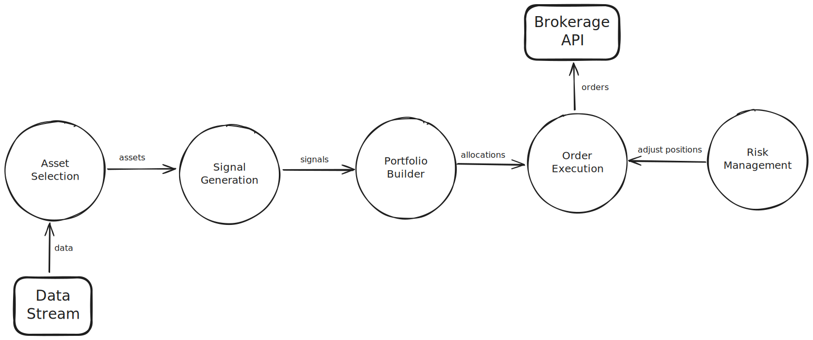

# Modular-Trader

## About The Project

Modular-trader is a algorithmic trading framework written in Python, designed with focus on modularity and flexibility. The framework provides solution as building blocks for live deployment of algorithmic trading, consists of five modules; Asset Selection, Signal Generation, Portfolio Builder, Order Execution and, Risk Management.

### Built-in Models 

#### Asset Selection 
- Manual

#### Signal Generation
- Constant

#### Portfolio Builder 
- EqualWeight
- ThresholdDeviation

#### Order Execution
- Instant

#### Risk Management
- FixedStopLoss

### Supported Brokerages

- [Alpaca](https://alpaca.markets/)

**Important Note**: We are not affiliated, associated, authorized, endorsed by, or in any way officially connected with Alpaca Securities LLC, or any of its subsidiaries or its affiliates. The official Alpaca Securities LLC website can be found at https://alpaca.markets/.

(<a href="#readme-top">back to top</a>)

## Documentation

(<a href="#readme-top">back to top</a>)

## Getting Started

### Prerequisites

### Installation

(<a href="#readme-top">back to top</a>)

## Usage 

(<a href="#readme-top">back to top</a>)

## Roadmap

(<a href="#readme-top">back to top</a>)

## License 
Distributed under the MIT License. See [`LICENSE`](https://github.com/kfuangsung/modular-trader/blob/main/LICENSE) for more information.

(<a href="#readme-top">back to top</a>)

## Maintainers

Modular-Trader is currently maintained by [kfuangsung](https://github.com/kfuangsung) (kachain.f@outlook.com).

**Important Note**: We do not provide technical support, or consulting and do not answer personal questions via email.

(<a href="#readme-top">back to top</a>)

## Acknowledgments

(<a href="#readme-top">back to top</a>)

## Disclaimer 
Authors and contributors of Modular-Trader cannot be held responsible for possible losses or other damage. Consequently, no claims for damages can be asserted. Please also note that trading has a certain addictive potential. If you find yourself at risk, please seek professional help.

(<a href="#readme-top">back to top</a>)
